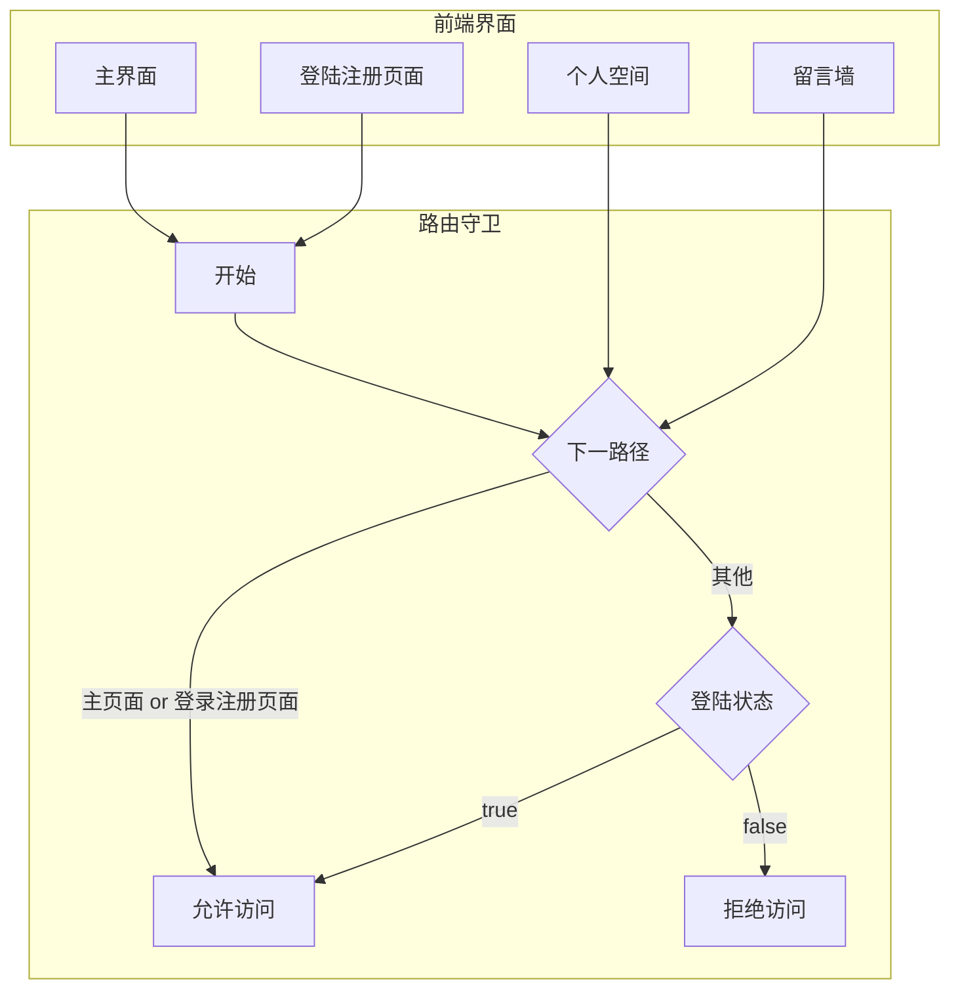
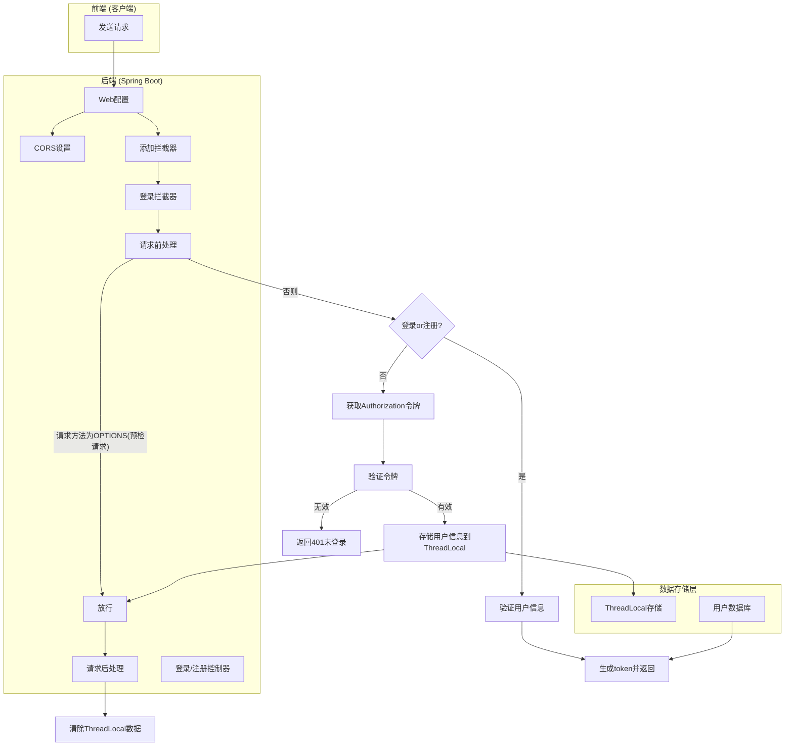
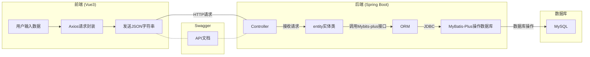

# 软件说明文档

## 项目介绍

### 1. 小组成员

| 小组成员 |         班级         |     学号     | 分工          |
| :------: | :------------------: | :----------: | ------------- |
|   王维   | 计算机科学与技术二班 | 320210942931 | 前端+设计文档 |
|  王逸夫  | 计算机科学与技术一班 | 320210942951 | 后端+数据库   |

### 2. 项目简介

> **医患一体——智慧病历系统**（`MediSmart`），旨在收集患者历史健康情况和以往病历，以便于患者对自身情况进行了解，也为医更全面深入的了解情况，做出诊断提供便利
>
> **预期受众**为医生、患者，以及对自身健康有深入了解需求的大众

### 3. 开发环境

> 基于`B/S`模式开发的前后端分离的`Web`应用
>
> 前端：`vue3`+`element-plus`+`eCharts`+`FontAwesome`
>
> 后端：`SpringBoot3`+`MybatisPlus`
>
> 数据库：`MySQL`
>
> 设计风格&接口文档：`RESTful`+`Swagger`
>
> 用户验证和安全：`JWT`跨域验证

### 4. 项目结构介绍

> - 前端
>
>   
>
> - 后端
>
>   
>
>   
>
> - 数据库
>
>   使用到的几个表如下所示：
>
>   

## 功能介绍

> 软件总共分为四个页面，各个页面及功能如下所示
>
> - 登录/注册页面
>   - 登录
>   - 注册
> - 主页面
>   - 浏览基本信息
>   - 退出登录
>   - 进入其他页面
> - 个人空间页面
>   - 个人信息修改
>   - 健康信息可视化
>     - 今日信息分析
>     - 一周信息分析
>     - 一个月信息分析
>   - 日历计划表
>     - 新增计划
>     - 删除计划
>     - 编辑计划
>     - 浏览计划
>   - 病历管理
>     - 浏览处方信息
>     - 体检信息可视化
> - 留言墙界面
>   - 浏览留言
>   - 发送留言
>
> 具体页面及功能如下所示

###  主页面

> 基本信息浏览，不需要登陆注册也能进入

#### 1. 基本信息浏览

> **基本信息**：
>
> 首页由轮播图、医学小贴士、医学小故事（南丁格尔小姐的回忆）、中页轮播图、医学著名人物介绍、尾页组成；

##### （1）轮播图及医学小贴士

<video src="https://markdown-wangwei.oss-cn-beijing.aliyuncs.com/1.mp4" controls="controls" width="100%"></video>

##### （2）医学小故事及中页轮播图

<video src="https://markdown-wangwei.oss-cn-beijing.aliyuncs.com/2.mp4" controls="controls" width="100%"></video>

##### （3）人物介绍+尾页

<video src="https://markdown-wangwei.oss-cn-beijing.aliyuncs.com/3.mp4" controls="controls" width="100%"></video>

#### 2.退出登录

> **退出登录**
>
> 登录状态下才有退出登录的选项，登陆状态时头像为用户头像，退出登陆之后为默认头像
>
> 登陆时可以进入个人空间和留言墙，未登录不行

<video src="https://markdown-wangwei.oss-cn-beijing.aliyuncs.com/4.mp4" controls="controls" width="100%"></video>

### 登录注册页面

> 对用户身份进行验证，不登陆无法进入后续个人空间和留言墙界面，注册时会验证密码是否符合格式（大于八位且还有两个不同种类字符），并检查该用户名是否存在

<video src="https://markdown-wangwei.oss-cn-beijing.aliyuncs.com/00.mp4" controls="controls" width="100%"></video>

### 个人空间

> 主要功能页面，主要包括以下四个子页面：
>
> - 个人信息
> - 健康数据
> - 健康flag
> - 历史病历

#### 1. 个人信息

> 对自己的个人信息进行查看编辑，因为图片不是存在本地服务器，而是存到`阿里云OSS`对象存储服务器，所以暂时还不能实现更改头像

<video src="https://markdown-wangwei.oss-cn-beijing.aliyuncs.com/01.mp4" controls="controls" width="100%"></video>

#### 2. 健康数据

> **数据获取**：基础数据如步数等是从小米手环`api`接口获取然后写入数据库的（因为权限原因只能获取我本人的数据），而其他体检数据来源于网络查找，得到`csv`文件后再导入数据库
>
> **页面规划:** 当天健康数据展示，一周健康数据对比，本月健康数据对比（与其他用户），数据图通过使用`eChart`制作

<video src="https://markdown-wangwei.oss-cn-beijing.aliyuncs.com/02.mp4" controls="controls" width="100%"></video>

#### 3. 健康flag

> 实现的功能有基础的日历查看，可以查看当天的日期，以及任意一天的目标查看、编辑、删除和新增

<video src="https://markdown-wangwei.oss-cn-beijing.aliyuncs.com/03.mp4" controls="controls" width="100%"></video>

#### 4. 病历查询

> 实现的功能有病历的查看、切换（无删除权限），以及体检信息的对比，这里的数据由于相关法令法规无法从`api`中获取，也是从`csv`文件中导入数据库的

<video src="https://markdown-wangwei.oss-cn-beijing.aliyuncs.com/04.mp4" controls="controls" width="100%"></video>

### 留言墙

> 即前面功能中提到的社区交流功能，由于时间限制，简单做成了留言墙的形式，支持留言上传和查看的功能（没有修改和删除的权限），点赞、评论转发等功能也没有实现

<video src="https://markdown-wangwei.oss-cn-beijing.aliyuncs.com/05.mp4" controls="controls" width="100%"></video>

## 权限管理

> 用户验证是安全的重中之重，为了实现对用户的权限管理
>
> - 前端访问`URL`：`Router`路由守卫
>
> - 后端访问接口：`JWT`跨域认证
>
>用一些交互示意图来示意用户的认证过程如下所示：

> 访问`url`(路由守卫)

> `JWT`跨域认证

> 前端收到返回的`token`令牌后，将`token`令牌和登陆状态`status`存储到`localStorage`中（前端路由守卫验证登录信息就是在这里验证），在发送登陆验证以外的请求时，将`token`一并返回给服务端

## 接口设计

> 前端：封装`Axios`并根据具体业务设计接口，接受的是用户直接输入的数据，面向的是请求的后端接口，发送的是`JSON`字符串
>
> 后端：通过`<String,Object>Map`或者`param`接受前端发送的数据(如果有的话)，并通过`Mybits-plus`接口中封装的方法，对数据库进行相应的业务操作
>
> 具体的`API`接口信息，通过`Swagger`接口导出，实现前后端之间的接口交互

> 接口交互设计中，我们采用了`RESTful`的设计风格
>
> | HTTP方法 |  操作  |                         返回值                          |                          特定返回值                          |
> | :------: | :----: | :-----------------------------------------------------: | :----------------------------------------------------------: |
> |   POST   | Create |             201（Created），提交或保存资源              |         404（Not Found），409（Conflict）资源已存在          |
> |   GET    |  Read  | 200（OK），获取资源或数据列表，支持分页、排序和条件查询 |        200（OK）返回资源，404（Not Found）资源不存在         |
> |  PATCH   | Update |        200（OK）`or` 204（No Content），修改资源        | 404（Not Found）资源不存在，405（Method Not Allowed）禁止使用该方法调用 |
> |  PATCH   | Update |       200（OK） `or` 204（NO Content），部分修改        |                  404（Not Found）资源不存在                  |
> |  DELETE  | Delete |                 200（OK），资源删除成功                 |                                                              |
>
> 通过特定的类`Result`来统一封装交互的数据，并设计统一的构造方法返回错误或者成功消息

## 数据结构

> 对于上述功能中介绍到的各类功能，共总结为以下七类数据：
>
> - 用户（`user`）
> - 病历（`MedicalRecord`）
> - 留言（`Message`）
> - 计划（`Flag`）
> - 基本健康数据（`PatientInfo`）
> - 体检数据（`PhysiologcalMetric`）
> - 睡眠监测数据(`SleepRecord`)
>
> 以上数据中，除了留言以外，剩余所以数据均以用户表为外键，删除用户的同时会将他们一并消除，基本健康数据和睡眠监测数据通过小米智能检测手环，能获取到每一天数据，体检数据和睡眠监测数据来源于网络上的数据集，病历为自主生成（所以只有三张），用户数据通过用户注册，修改，上传
>
> 具体的数据信息和结构如下所示：
>
> - 用户表
>
>   | 字段名 | 含义 | 描述 |
>   | :----: | :------: | :------: |
>   | id   | 用户ID | 主键，自增，唯一标识每个用户的编号 |
>   | username | 用户名 | 唯一，不能为空，用于登录和身份识别 |
>   | password | 密码 | 用户登录密码，不能为空 |
>   | phone | 电话号码 | 用户的联系电话 |
>   | registerTime | 注册时间 | 用户注册的时间，自动记录当前时间 |
>   | avatarUrl | 头像URL | 用户的头像图片链接，默认使用一个预设的头像URL |
>   | birthday | 生日 | 用户的出生日期 |
>   | nickname | 昵称 | 用户的昵称，非必需，不唯一 |
>   
> - 病历表
>
>   | 字段名                        | 中文意思     | 字段描述                                               |
>   | ----------------------------- | ------------ | ------------------------------------------------------ |
>   | record_id                     | 记录ID       | 主键，自增，唯一标识每条病历记录的编号                 |
>   | userid                        | 用户ID       | 外键，关联到用户表的用户ID，表示该病历记录属于哪个用户 |
>   | visit_date                    | 就诊日期     | 就诊日期和时间                                         |
>   | main_symptoms                 | 主要症状     | 患者的主要症状描述                                     |
>   | present_illness_history       | 现病史       | 患者目前的病史描述                                     |
>   | past_history                  | 既往史       | 患者的既往病史描述                                     |
>   | family_history                | 家族史       | 患者的家族病史描述                                     |
>   | personal_history              | 个人史       | 患者的个人生活史描述                                   |
>   | physical_examination          | 体格检查     | 医生对患者进行的体格检查结果描述                       |
>   | auxiliary_examination_results | 辅助检查结果 | 患者进行的各种辅助检查的结果描述                       |
>   | final_diagnosis               | 最终诊断     | 医生对患者的最终诊断结果描述                           |
>   | treatment_plan                | 治疗方案     | 医生为患者制定的治疗方案描述                           |
>   | course_of_disease             | 病程         | 患者疾病的发展过程描述                                 |
>   | discharge_summary             | 出院小结     | 患者出院时的医疗总结描述                               |
>
> - 留言表
>
>   | 字段名   | 中文意思 | 字段描述                             |
>   | -------- | -------- | ------------------------------------ |
>   | id       | 留言ID   | 主键，自增，唯一标识每条留言的编号   |
>   | nickname | 昵称     | 发表留言的用户昵称，可选，默认为匿名 |
>   | message  | 留言内容 | 用户留言的文本内容                   |
>   | date     | 留言日期 | 留言发布的日期                       |
>   | category | 留言类别 | 留言的分类标签，可选，默认为“其他”   |
>
> - 计划表
>
>   | 字段名   | 中文意思 | 字段描述                                           |
>   | -------- | -------- | -------------------------------------------------- |
>   | id       | 计划ID   | 主键，自增，唯一标识每个计划的编号                 |
>   | userid   | 用户ID   | 外键，关联到用户表的用户ID，表示该计划属于哪个用户 |
>   | plandate | 计划日期 | 计划的日期                                         |
>   | plans    | 计划内容 | 计划的具体内容描述                                 |
>
> - 基础健康表
>
>   | 字段名      | 中文意思   | 字段描述                                               |
>   | ----------- | ---------- | ------------------------------------------------------ |
>   | id          | 健康数据ID | 主键，自增，唯一标识每条健康数据的编号                 |
>   | userid      | 用户ID     | 外键，关联到用户表的用户ID，表示该健康数据属于哪个用户 |
>   | date        | 数据日期   | 健康数据记录的日期                                     |
>   | steps       | 步数       | 用户当天行走的步数                                     |
>   | distance    | 距离       | 用户当天行走的总距离（单位：米）                       |
>   | runDistance | 跑步距离   | 用户当天跑步的距离（单位：米）                         |
>   | calories    | 消耗卡路里 | 用户当天消耗的卡路里数                                 |
>
> - 体检数据表
>
>   | 字段名                   | 中文意思 | 字段描述                                               |
>   | ------------------------ | -------- | ------------------------------------------------------ |
>   | id                       | 数据ID   | 主键，自增，唯一标识每条体检数据的编号                 |
>   | user_id                  | 用户ID   | 外键，关联到用户表的用户ID，表示该体检数据属于哪个用户 |
>   | timestamp                | 时间戳   | 数据记录的时间戳                                       |
>   | temperature              | 体温     | 测量的体温数值                                         |
>   | heart_rate               | 心率     | 测量的心率数值                                         |
>   | blood_pressure_systolic  | 收缩压   | 测量的收缩压数值                                       |
>   | blood_pressure_diastolic | 舒张压   | 测量的舒张压数值                                       |
>   | blood_oxygen_level       | 血氧水平 | 测量的血氧饱和度数值                                   |
>   | blood_glucose_level      | 血糖水平 | 测量的血糖浓度数值                                     |
>
> - 睡眠检测表
>
>   | 字段名           | 中文意思   | 字段描述                                               |
>   | ---------------- | ---------- | ------------------------------------------------------ |
>   | id               | 睡眠记录ID | 主键，自增，唯一标识每条睡眠记录的编号                 |
>   | userid           | 用户ID     | 外键，关联到用户表的用户ID，表示该睡眠记录属于哪个用户 |
>   | date             | 睡眠日期   | 睡眠记录的日期                                         |
>   | deepSleepTime    | 深睡时长   | 用户深度睡眠时长（单位：分钟）                         |
>   | shallowSleepTime | 浅睡时长   | 用户浅度睡眠时长（单位：分钟）                         |
>   | wakeTime         | 清醒时长   | 用户清醒时长（单位：分钟）                             |
>   | start            | 开始时间   | 睡眠记录开始时间                                       |
>   | stop             | 结束时间   | 睡眠记录结束时间                                       |
>   | REMTime          | REM时长    | 用户快速眼动睡眠时长（单位：分钟）                     |
>   | naps             | 小睡记录   | 用户可能记录的小睡情况，存储为JSON格式数据             |
>
> 每一个数据库中的表，在`SpringBoot`的entity、Mapper和Controller层中都有一个实体类、接口以及控制器与其对应，在`Vue`的`api`（为我自定义，可以直接调用Axios但太麻烦）文件夹中都有一个ts文件，定义接口和传递数据的函数，以user类为例
>
> 
>
> **静态资源存储**
>
> 整个项目中用到的所有图片，除了网站头标以外全部都上传到了阿里云`OSS`对象存储云端中，通过引用`Url`直接调用
>
> 

## 总结感想

> 实际开发该软件共两星期，但实际上构思该软件却历经了整整一个学期，最后开发的时候基本是不眠不休，莫名其妙的bug、json字符串、Java对象和数据库表之间转化出错、缺少各种依赖项、注解的运用从生疏到熟练、为了一个图标的旋转绞劲脑汁、为了一张图片的格式反复纠结，甚至出现网上根本找不到的错误，最后深入了解maven项目原理，将target文件夹设置本地项目检测才解决问题，最后完成本次软件功能大作业，除去部署云端和图片上传外，其余设想功能全部实现。
>
> 开发一个软件遇到的困难是痛苦的，但一步步实现自己的想法，一步步提高自己的水平，了解更多别人有趣创意的经历是美好的，我们二人一路走来，对此感悟颇深，学习软件工程课程、了解软件开发技术、亲自设想实践完成，一路走来，我们感受到了前所未有的成就感和满足感。
>
> 最后整体演示视频如下：

<video src="https://markdown-wangwei.oss-cn-beijing.aliyuncs.com/all2.mp4" controls="controls" width="100%"></video>
